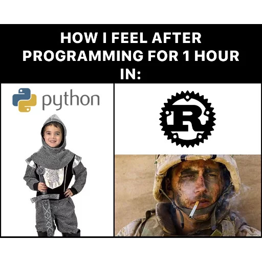
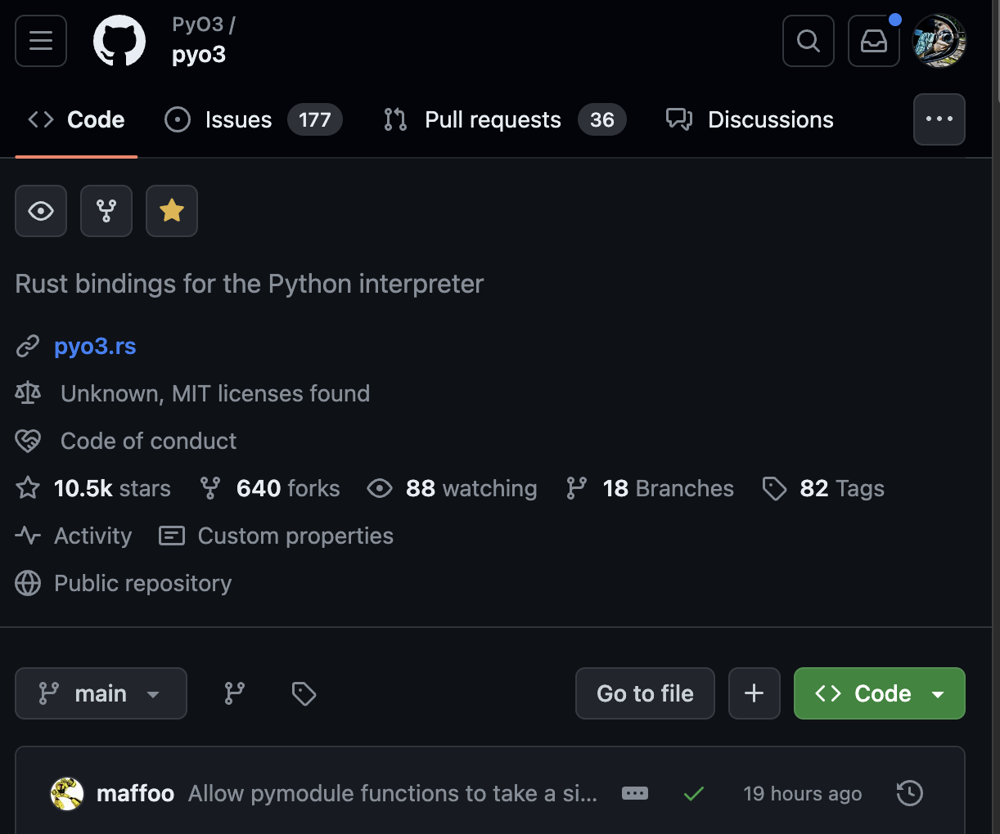
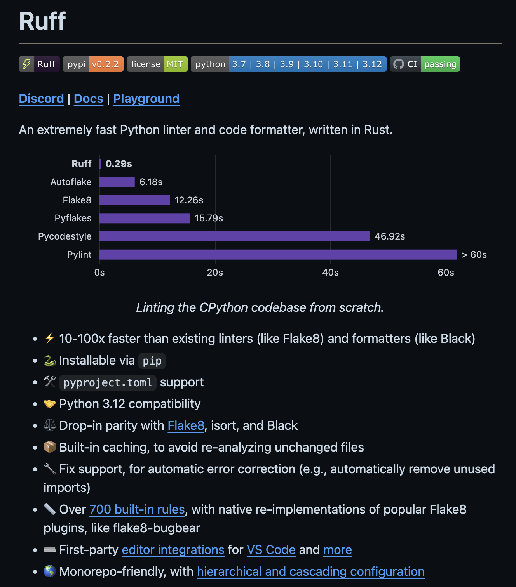
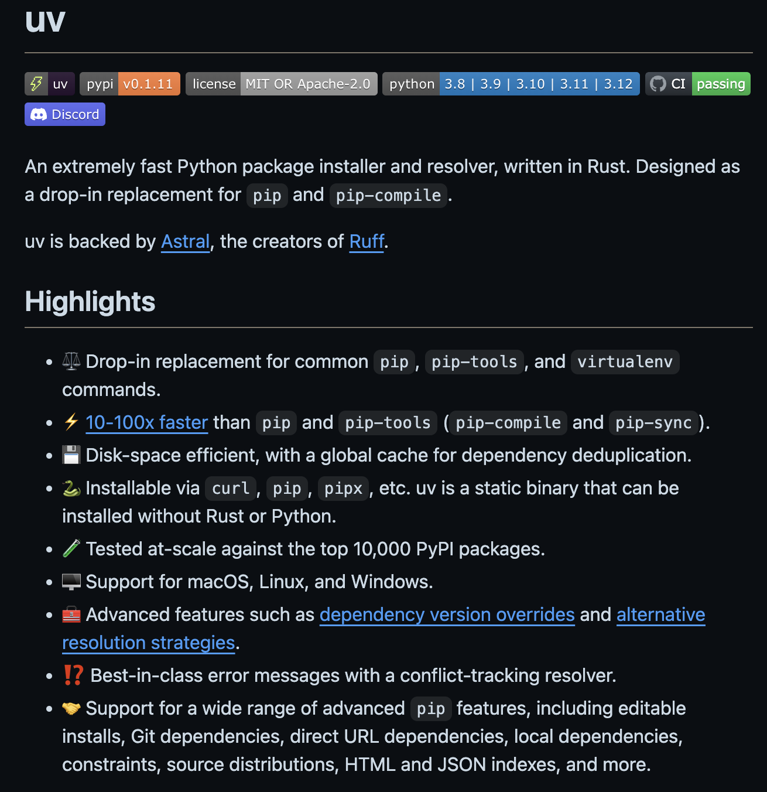
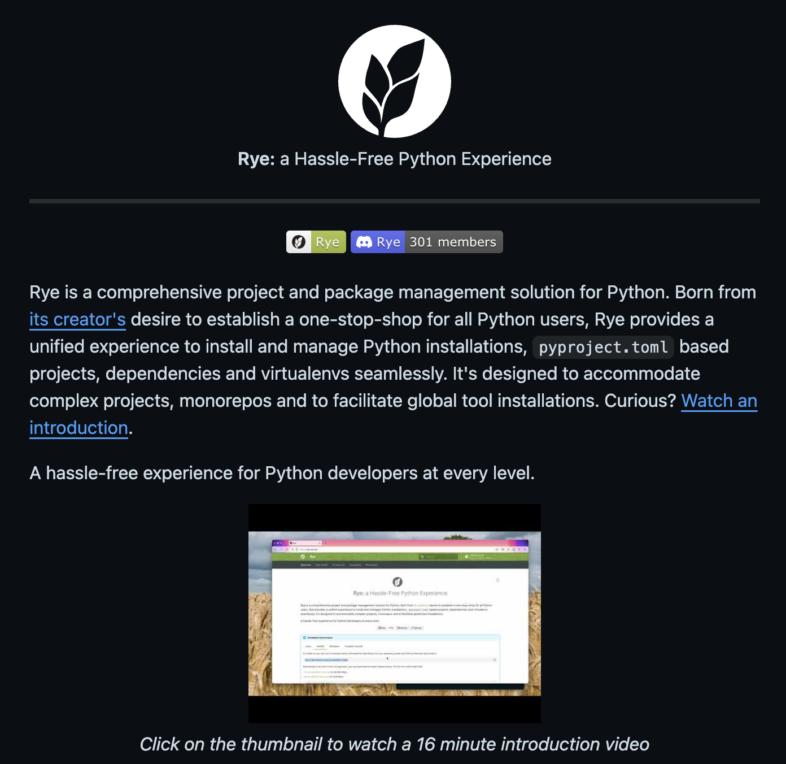

Today, we'll explore how Rust, a programming language known for its performance, safety and being super hard to learn, can significantly enhance Python development.
By leveraging Rust bindings to seamlessly integrate Rust libraries into Python applications, as well as utilizing Rust-built tools such as formatters and package managers, I'll demonstrate how this powerful combination can accelerate Python development while maintaining high performance and reliability. Let's delve into the exciting possibilities of marrying Rust's efficiency with Python's versatility for robust application development.

# Bindings

Rust bindings for Python are a bridge that allows developers to seamlessly integrate Rust code with Python programs.

There's a library called `pyo3` that provides a way to write Python bindings in Rust.

There are already many tools and libraries that are written in Rust and can be used in Python.

- orjson, Fast, correct Python JSON library supporting dataclasses, datetimes, and numpy
- polars, Dataframes powered by a multithreaded, vectorized query engine, written in Rus
- pydantic-core, Core validation logic for pydantic written in rust

You can also write your own Rust library and use it in Python.

I'll give you a link to a great article about how Rust solved a performance problem in a 3D processing pipeline.

The article discusses enhancing Python performance by integrating Rust, focusing on optimizing this company's core Python library used in a 3D processing pipeline.
Facing scalability issues with increased workload, the team sought to make the system significantly faster, turning to Rust for its performance benefits.
By iteratively optimizing specific functions like finding close polygons, significant performance gains of up to 100x were achieved through careful Rust integration, while retaining the original Python API and ensuring minimal compromises.
The process involved profiling, rewriting critical functions in Rust, and addressing memory allocation overhead, showcasing the powerful combination of Rust's native performance and Python's ease of use for researchers.

# Tooling

- ruff, A Rust formatter that is compatible with black and almost all others Python linters

  https://github.com/astral-sh/ruff

- uv, a very fast (but still young) alternative to pip for installing packages

  https://github.com/astral-sh/uv

- rye, awesome package manager for Python, inspired by Rust's cargo

  https://github.com/astral-sh/rye

# Links:

https://ohadravid.github.io/posts/2023-03-rusty-python/
https://github.com/PyO3/pyo3
https://github.com/ijl/orjson
https://github.com/pola-rs/polars
https://github.com/pydantic/pydantic-core

https://github.com/astral-sh/ruff
https://github.com/astral-sh/uv
https://github.com/astral-sh/rye

https://www.infoworld.com/article/3664124/how-to-use-rust-with-python-and-python-with-rust.html
