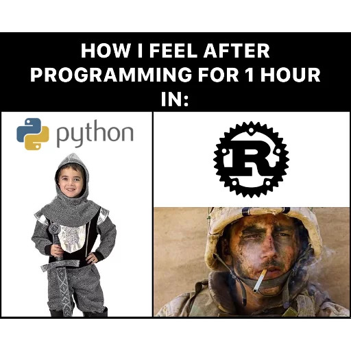
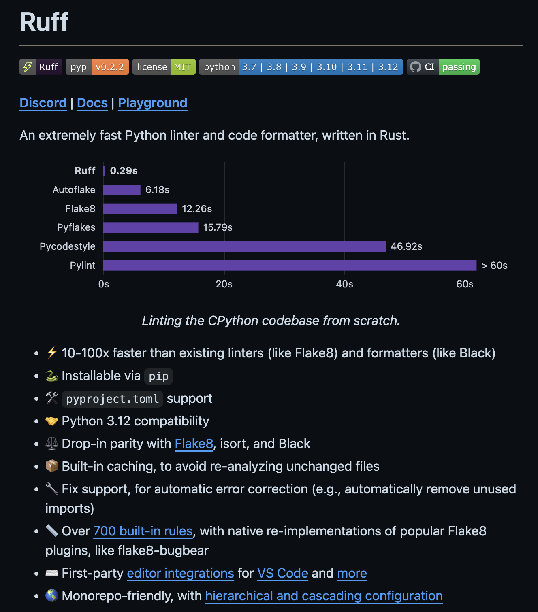
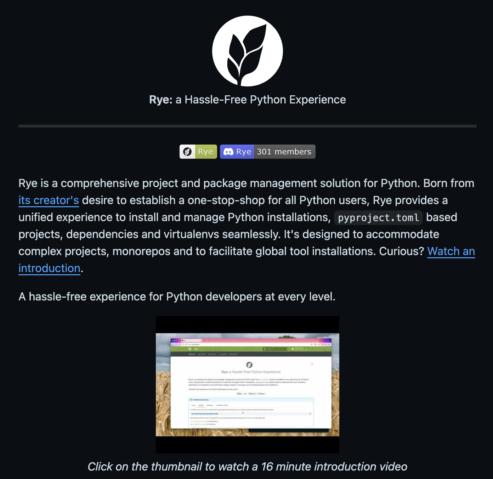

<style>
  img.small {
    width: 200px;

  }
  div.small {
    font-size: 0.5em;
  }
</style>


## How Rust is speeding up Python (bindings and tooling)

"Rust and Python: A Match Made in Heaven\*"

Piotr Grędowski, CoPy #5 @Ørsted, 06.03.2024

<div class="small">*That's a subtitle generated by accident by Github Copilot. It's quite funny so I left it.</div>

Note:
That's a subtitle generated by accident by Github Copilot. It's quite funny so I left it.

<!--s-->



Note:
Today, we'll explore how Rust, a programming language known for its performance, safety and being super hard to learn, can significantly enhance Python development.

By leveraging Rust bindings to seamlessly integrate Rust libraries into Python applications, as well as utilizing Rust-built tools such as formatters and package managers, I'll demonstrate how this powerful combination can accelerate Python development while maintaining high performance and reliability. Let's delve into the exciting possibilities of marrying Rust's efficiency with Python's versatility for robust application development.

<!--s-->

# Bindings

<!-- .slide: data-background="images/pyo3.png" -->

<!--s-->

## What are bindings?

Rust bindings for Python are a bridge that allows developers to seamlessly integrate Rust code with Python programs.

Note:
There's a library called `pyo3` that provides a way to write Python bindings in Rust.

Thanks to that we can write Python modules in Rust and use them in Python.

Of course there are already many tools and libraries that are written in Rust and can be used in Python.

<!--s-->

## Python libraries written in Rust, great examples:

- **orjson**, Fast, correct Python JSON library supporting dataclasses, datetimes, and numpy
- **polars**, Dataframes powered by a multithreaded, vectorized query engine, written in Rust
- **pydantic-core**, Core validation logic for pydantic written in Rust

<!--s-->

### Outsourcing performance-critical code from Python to Rust,

Article by Ohad Ravid


<!--v-->

Starting point, Python implementation

```python
def find_close_polygons(
    polygon_subset: List[Polygon], point: np.array, max_dist: float
) -> List[Polygon]:
    close_polygons = []
    for poly in polygon_subset:
        if np.linalg.norm(poly.center - point) < max_dist:
            close_polygons.append(poly)

    return close_polygons
```

Iteration time

```bash
$ python measure.py
Took an avg of 293.41ms per iteration
```

<!--v-->

<style>
pre.code-wrapper {
  font-size: 0.4em;
  height: 70%;
}
</style>

After rewriting to Rust...

```rust
use pyo3::prelude::*;

use ndarray_linalg::Norm;
use numpy::PyReadonlyArray1;

#[pyfunction]
fn find_close_polygons(
    py: Python<'_>,
    polygons: Vec<PyObject>,
    point: PyReadonlyArray1<f64>,
    max_dist: f64,
) -> PyResult<Vec<PyObject>> {
    let mut close_polygons = vec![];
    let point = point.as_array();
    for poly in polygons {
        let center = poly
            .getattr(py, "center")?
            .extract::<PyReadonlyArray1<f64>>(py)?
            .as_array()
            .to_owned();

        if (center - point).norm() < max_dist {
            close_polygons.push(poly)
        }
    }

    Ok(close_polygons)
}
```

How much time will it take?

<style>
  div.slide-background-content {
    opacity: 0.5;
  }
</style>
```bash
$ (cd ./poly_match_rs/ && maturin develop)
$ python measure.py
Took an avg of ??????s per iteration
```

<!--v-->

Starting point, Python code

```bash
$ python measure.py
Took an avg of 293.41ms per iteration
```

After rewriting to Rust

<!-- .slide: data-background="images/what.png" -->

```bash
$ (cd ./poly_match_rs/ && maturin develop)
$ python measure.py
Took an avg of 609.46ms per iteration
```
<!-- style a div to make all elements centered vertically -->
<div style="display: flex; align-items: center; justify-content: center;">
  
  <p><b style="color: red">609.46ms</b> per iteration!</p>
  
</div>

<!--v-->

After rewriting to Rust and buiding with release flag

```bash
$ (cd ./poly_match_rs/ && maturin develop --release)
$ python measure.py
Took an avg of 23.44ms per iteration
```

After all improvements

```bash
$ python measure.py
Took an avg of 2.90ms per iteration
```
<!--v-->

Starting with Python implementation

```python
@dataclass
class Polygon:
    x: np.array
    y: np.array
    _area: float = None

    @cached_property
    def center(self) -> np.array:
        centroid = np.array([self.x, self.y]).mean(axis=1)
        return centroid

    def area(self) -> float:
        ...

def find_close_polygons(
    polygon_subset: List[Polygon], point: np.array, max_dist: float
) -> List[Polygon]:
    close_polygons = []
    for poly in polygon_subset:
        if np.linalg.norm(poly.center - point) < max_dist:
            close_polygons.append(poly)

    return close_polygons
```

```python
import poly_match_rs

poly_match_rs.Polygon
poly_match_rs.find_close_polygons

...
```

Note:
You can also write your own Rust library and use it in Python.

I'll give you a link to a great article about how Rust solved a performance problem in a 3D processing pipeline.

The article discusses enhancing Python performance by integrating Rust, focusing on optimizing application's core Python library used in a 3D processing pipeline.
Facing scalability issues with increased workload, the team sought to make the system significantly faster, turning to Rust for its performance benefits.
By iteratively optimizing specific functions like finding close polygons, significant performance gains of up to 100x were achieved through careful Rust integration, while retaining the original Python API and ensuring minimal compromises.
The process involved profiling, rewriting critical functions in Rust, and addressing memory allocation overhead, showcasing the powerful combination of Rust's native performance and Python's ease of use for researchers.


<!--s-->

# Tooling

<!--s-->

- **ruff**, A Rust formatter that is compatible with black and almost all others Python linters

  https://github.com/astral-sh/ruff



<!--v-->

- **uv**, a very fast (but still young) alternative to pip for installing packages

  https://github.com/astral-sh/uv


<!--v-->

- **rye**, awesome package manager for Python, inspired by Rust's cargo

  https://github.com/astral-sh/rye



<!--s-->

### Links:

[https://ohadravid.github.io/posts/2023-03-rusty-python/](https://ohadravid.github.io/posts/2023-03-rusty-python/)

[pyo3](https://github.com/PyO3/pyo3), [orjson](https://github.com/ijl/orjson), [polars](https://github.com/pola-rs/polars), [pydantic-core](https://github.com/pydantic/pydantic-core)

[ruff](https://github.com/astral-sh/ruff), [uv](https://github.com/astral-sh/uv), [rye](https://github.com/astral-sh/rye)

[An Introduction to Coding In Rust for Pythonistas by ArjanCodes](https://www.youtube.com/watch?v=MoqtsYLGCC4)

[Combining Rust and Python: The Best of Both Worlds? by ArjanCodes](https://www.youtube.com/watch?v=lyG6AKzu4ew)

[how-to-use-rust-with-python-and-python-with-rust](https://www.infoworld.com/article/3664124/how-to-use-rust-with-python-and-python-with-rust.html)
